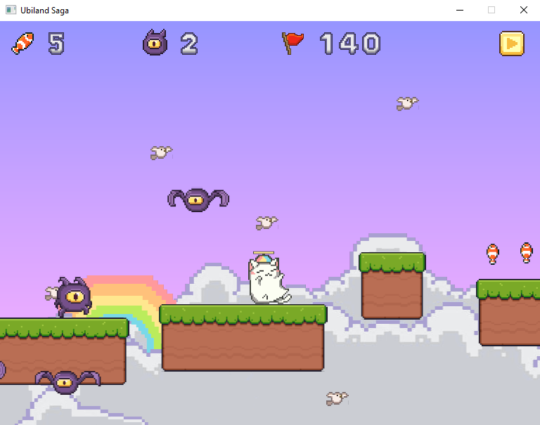

# Ubiland Saga

A flappy-bird-like game made using Rust and OpenGL

---

## Demo

## Controls

- `UP` to flap and `RIGHT` to fly
- `UP` `LEFT` `RIGHT` to move around on a platform
- `ESC` to pause the game
- `UP` and `DOWN` to select from the menus
- Jump on enemies to kill them and collect fish

 

---

